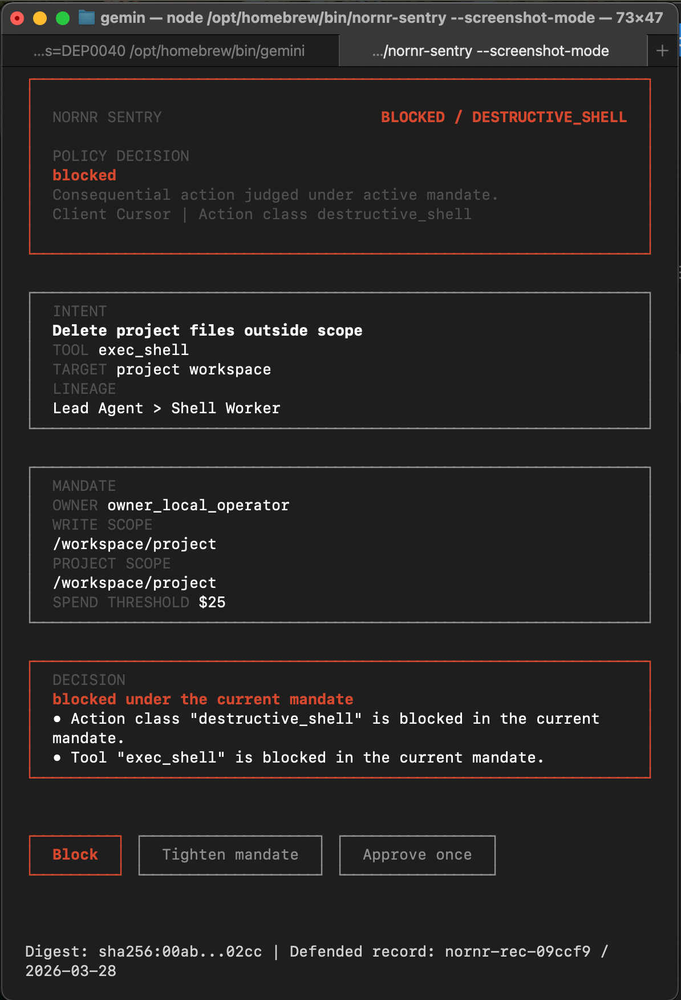
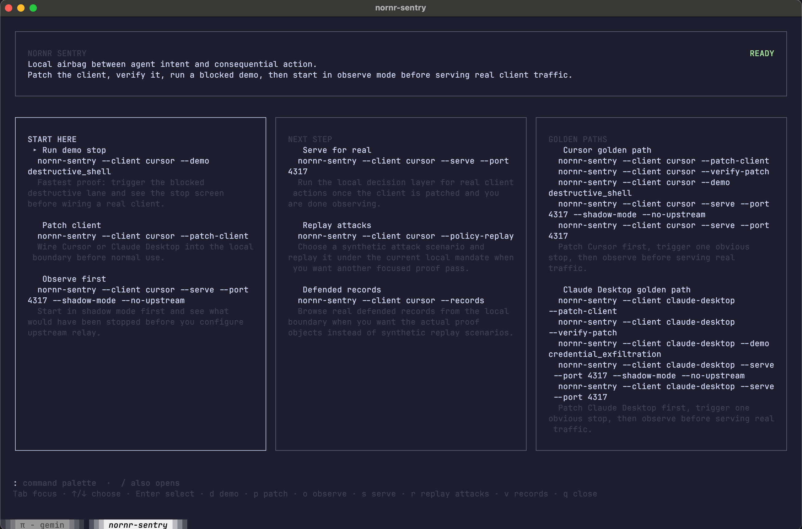

# NORNR Sentry

`NORNR Sentry` is the local airbag for one dangerous agent action.

It is also the local decision layer for consequential agent actions.



This public repo is the open wedge:

- one dangerous action
- one stop-screen
- one mandate conflict
- one human choice
- one defended record afterward

It is not the hosted NORNR control plane.

## Operator station



After install, Sentry opens into a local operator station for patch / wiring, verify, replay, records, proof hub and serve flows. Use the blocked stop-screen as the first proof image, and this screen as the second image that shows the product is a real navigable tool after the first stop.

## Proof

- Hero stop-screen: [nornr-sentry-blocked-stop-screen.png](./site/assets/nornr-sentry-blocked-stop-screen.png)
- Operator station: [nornr-sentry-operator-station.png](./site/assets/nornr-sentry-operator-station.png)
- Proof clip: [nornr-sentry-proof-clip-final.mp4](./site/assets/nornr-sentry-proof-clip-final.mp4)
- X-optimized clip: [nornr-sentry-proof-clip-x.mp4](./site/assets/nornr-sentry-proof-clip-x.mp4)

## Install

Fastest path to the first stop:

```bash
npx nornr-sentry --first-stop
```

Diagnose the real local path from install to proof:

```bash
npx nornr-sentry --doctor
```

Resume the latest local review context:

```bash
npx nornr-sentry --resume
```

Compare clean-room trust modes across the built-in scenario corpus:

```bash
npx nornr-sentry --eval-harness
```

Open the chooser only when you need a different desktop patch or provider wiring target:

```bash
npx nornr-sentry --patch-client
```

Open the defended record browser after the first stop:

```bash
npx nornr-sentry --records
```

Or install globally:

```bash
npm install -g nornr-sentry
```

Update an older global install in one command:

```bash
npm install -g nornr-sentry@latest
```

Run the latest version once without updating the global install:

```bash
npx nornr-sentry@latest --first-stop
```

## Public proof flow

1. Run `npx nornr-sentry --first-stop`.
2. Patch / wire and verify the real target.
3. Run one obvious stop.
4. Open the proof queue and export the defended record.
5. Open the records browser after the first stop so the proof step is visible too.
6. Observe first in shadow mode.
7. Serve for real.

Or clone and run locally:

```bash
npm install
npm run demo:cursor
```

## Experiment matrix

See [FIRST_STOP_EXPERIMENT_MATRIX.md](./FIRST_STOP_EXPERIMENT_MATRIX.md) for the live public first-stop CTA/copy variants and the proof-step readout.

See [CLEAN_ROOM_FEATURE_HARVEST.md](./CLEAN_ROOM_FEATURE_HARVEST.md) for the longer clean-room product and systems harvest behind the current Sentry roadmap.

## NPM release

```bash
npm run qa:public-package
cd ../../dist/nornr-sentry-public
npm publish
```

## What is in this public repo

- local proxy runtime
- local TUI review
- patch flow for Cursor and Claude Desktop
- local mandate init and tighten loop
- policy replay demo
- shadow mode and shadow conversion
- defended records proof queue
- defended record export
- local proof summary

## What is not in this public repo

Hosted NORNR control-plane features stay private for now:

- team governance
- hosted review and sync
- baseline registry and fleet rollout
- signer governance
- fleet compliance and remediation
- recovery control plane

## Golden path install

Start with the chooser if you want the product to tell you which path is real:

```bash
node bin/nornr-sentry.js --patch-client
node bin/nornr-sentry.js --verify-patch
```

Cursor direct path:

```bash
node bin/nornr-sentry.js --client cursor --patch-client
node bin/nornr-sentry.js --client cursor --verify-patch
node bin/nornr-sentry.js --client cursor --demo destructive_shell
node bin/nornr-sentry.js --client cursor --serve --shadow-mode --no-upstream
node bin/nornr-sentry.js --client cursor --serve
```

Claude Desktop direct path:

```bash
node bin/nornr-sentry.js --client claude-desktop --patch-client
node bin/nornr-sentry.js --client claude-desktop --verify-patch
node bin/nornr-sentry.js --client claude-desktop --demo credential_exfiltration
node bin/nornr-sentry.js --client claude-desktop --serve --shadow-mode --no-upstream
node bin/nornr-sentry.js --client claude-desktop --serve
```

Windsurf also uses a manual MCP/wiring path today instead of a built-in desktop patch:

```bash
node bin/nornr-sentry.js --patch-guide windsurf
```

OpenAI / Codex-style traffic does not use a desktop patch. Start with the wiring guide instead:

```bash
node bin/nornr-sentry.js --patch-guide openai-codex
```

Generic MCP also uses a manual wiring path instead of a built-in patch:

```bash
node bin/nornr-sentry.js --patch-guide generic-mcp
```

## Choose patch / wiring path

Open the chooser:

```bash
node bin/nornr-sentry.js --patch-client
```

Or jump straight to a known desktop client:

```bash
node bin/nornr-sentry.js --client cursor --patch-client
node bin/nornr-sentry.js --client claude-desktop --patch-client
```

## Run the demo

```bash
node bin/nornr-sentry.js --client cursor --demo destructive_shell
```

## Replay attacks

Synthetic replay path:

```bash
node bin/nornr-sentry.js --client cursor --policy-replay
```

Shortcut:

```bash
node bin/nornr-sentry.js --client cursor --policy-replay-demo --demo destructive_shell
```

## Serve locally

```bash
node bin/nornr-sentry.js --client cursor --serve
```

Then point a provider-style client at:

```bash
export OPENAI_BASE_URL=http://127.0.0.1:4317/v1
```

Quiet live trace:

```bash
node bin/nornr-sentry.js --client cursor --serve --verbose
```

Ambient trust mode:

```bash
node bin/nornr-sentry.js --client cursor --serve --ambient-trust
```

## Shadow mode

```bash
node bin/nornr-sentry.js --client cursor --serve --shadow-mode
```

Preview the enforce-now pack:

```bash
node bin/nornr-sentry.js --client cursor --shadow-conversion
```

## Local mandate loop

Preview one project-scoped mandate:

```bash
node bin/nornr-sentry.js --client cursor --mandate-init
```

Apply it:

```bash
node bin/nornr-sentry.js --client cursor --mandate-init --apply
```

Learn a tighter mandate from cleared usage:

```bash
node bin/nornr-sentry.js --client cursor --learned-mandate
```

Apply the learned diff:

```bash
node bin/nornr-sentry.js --client cursor --learned-mandate --apply
```

Read tighten history:

```bash
node bin/nornr-sentry.js --client cursor --tighten-history
```

## Local proof

Summary:

```bash
node bin/nornr-sentry.js --summary
```

Browse real defended records:

```bash
node bin/nornr-sentry.js --client cursor --records
```

Open the proof hub:

```bash
node bin/nornr-sentry.js --client cursor --proof-hub
```

Replay recent real records:

```bash
node bin/nornr-sentry.js --client cursor --record-replay
```

Export the latest defended record:

```bash
node bin/nornr-sentry.js --client cursor --export-record latest
```

Copy a public-safe share variant directly:

```bash
node bin/nornr-sentry.js --client cursor --export-record latest --copy-share summary
node bin/nornr-sentry.js --client cursor --export-record latest --copy-share x
node bin/nornr-sentry.js --client cursor --export-record latest --copy-share issue
```

Or export one specific defended record:

```bash
node bin/nornr-sentry.js --client cursor --export-record /absolute/path/to/record.json
```

You can also filter the browser:

```bash
node bin/nornr-sentry.js --client cursor --records --records-filter blocked --records-sort latest
```

## Golden path wizard

```bash
node bin/nornr-sentry.js --client cursor --golden-path
node bin/nornr-sentry.js --client claude-desktop --golden-path
```

## Choose verify target

Open the chooser:

```bash
node bin/nornr-sentry.js --verify-patch
```

Or verify a known desktop client directly:

```bash
node bin/nornr-sentry.js --client cursor --verify-patch
node bin/nornr-sentry.js --client claude-desktop --verify-patch
```

For Windsurf, OpenAI / Codex-style traffic, or Generic MCP, use the wiring guide instead of desktop patch verification:

```bash
node bin/nornr-sentry.js --patch-guide windsurf
node bin/nornr-sentry.js --patch-guide openai-codex
node bin/nornr-sentry.js --patch-guide generic-mcp
```

## Print snippets

Client config:

```bash
node bin/nornr-sentry.js --client cursor --print-config
```

Provider snippets:

```bash
node bin/nornr-sentry.js --client cursor --print-provider openai
node bin/nornr-sentry.js --client cursor --print-provider anthropic
```

Recording flow:

```bash
node bin/nornr-sentry.js --client cursor --print-demo-flow openai
```
